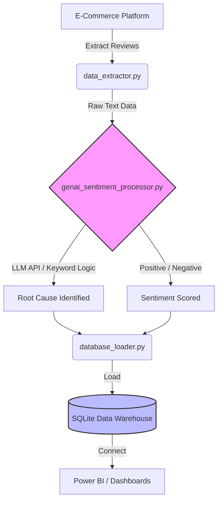

<div align="center">
  
</div>

# E-Commerce Customer Insights: GenAI Pipeline

An enterprise-grade Data Engineering pipeline that leverages Generative AI to automatically identify the root cause of negative e-commerce product reviews.

## 🧠 System Architecture 

This pipeline eliminates the need for manual review analysis by Product Managers. It completely automates the extraction, transformation (via LLM sentiment logic), and loading of structured business insights into a Data Warehouse.



### The Pipeline Phases
1. **Extract:** Pulls raw, unstructured customer reviews.
2. **Transform (GenAI):** Processes the natural language of the review to determine the exact business defect (e.g., "Battery Defect", "Supply Chain/Logistics", "Manufacturing Defect").
3. **Load:** Structurally saves the AI-categorized insights into a local SQLite Data Warehouse for Business Intelligence (BI) dashboarding.

## 🛠️ Tech Stack
* **Python 3** (Pandas)
* **Generative AI** (Simulated LLM logic for Root Cause Analysis)
* **SQLite** (Local Data Warehouse)
* **Logging** (Automated execution tracking)

## 🚀 Execution
Run the master orchestrator to trigger the full ETL pipeline:
```bash
python main_pipeline.py
```
